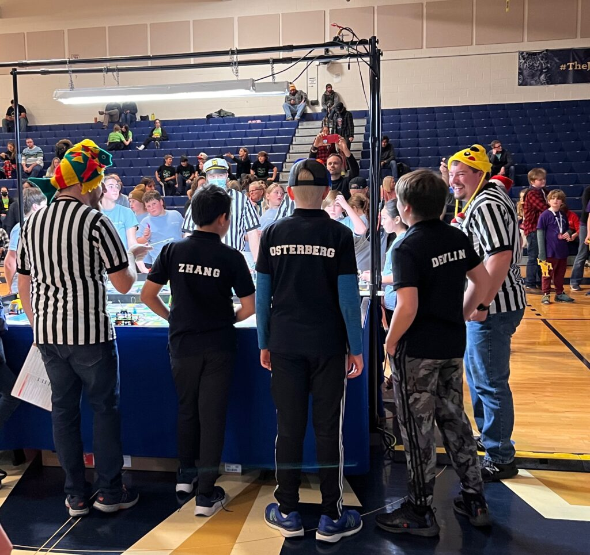
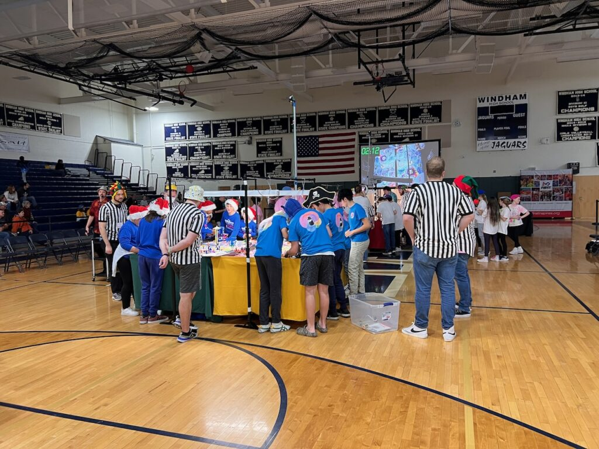

## Navigation
- [Home](/index.md) - [Our Team](/our-team/index.md) - [Robot Design](/happy-haptic-doctors-robot-design/index.md) - [2023 FLL](/2023-fll/index.md) - [2024 Worlds](/2024-worlds/index.md) - [2024 Highlights](/2024/index.md) - [2025](/2025/index.md) - [Donate](/donate/index.md)

---

# 2024 Worlds
The New Hampshire state competition had 46 teams competing, and [our team](../our-team/index.html) got first place! Since we won, we earned an invitation to the [2024 FIRST Championship](https://www.firstchampionship.org/), in Houston, April 17-20. For worlds, we are trying to patent our innovation project and upgrade our robot from EV3 to SPIKE to improve the robot.

---

## Competition Categories

1. **Robot Game**: Complete missions on the challenge board. This portion of the game seems like the main focus, but it isn’t the whole competition.
2. **Robot Design**: Present to judges about how your robot works, the inspiration, different iterations, and why it works well.
3. **Innovation Project**: Find and present about a solution to a real world problem in your community based on the year's theme.
4. **Core Values**: The most important category, showing teamwork and innovation. Our team got 100% in every category for core values!

---

## Our Journey to Worlds

### December 3, 2022

Several of us were on a team in 2022. We made it to states and although we didn’t win, it was great practice for this year!

### September 15, 2023
**This year’s team – the Happy Haptic Doctors**  
We formed our new team for 2023.

### November 8, 2023

We designed a logo for our team.

### November 18, 2023
**Regional Competition**  
We competed in a regional event and were able to advance to the state competition!

### December 2, 2023

At the state competition, we received a perfect score in Core Values (Discovery, Innovation, Impact, Inclusion, Teamwork, and Fun). This was critical to our overall 1st place finish!

### December 10, 2023

We rebuilt our robot to use Spike Prime instead of EV3, in preparation for Worlds.

### April 17, 2024

2024 FIRST Championship in Houston with ~50,000 attendees.

---

## Fundraising

One challenge we are facing is the cost, so we are going to start fundraising to raise money to make sure our entire team can keep competing. If you would like to help, please consider [donating](../donate/index.html)!

