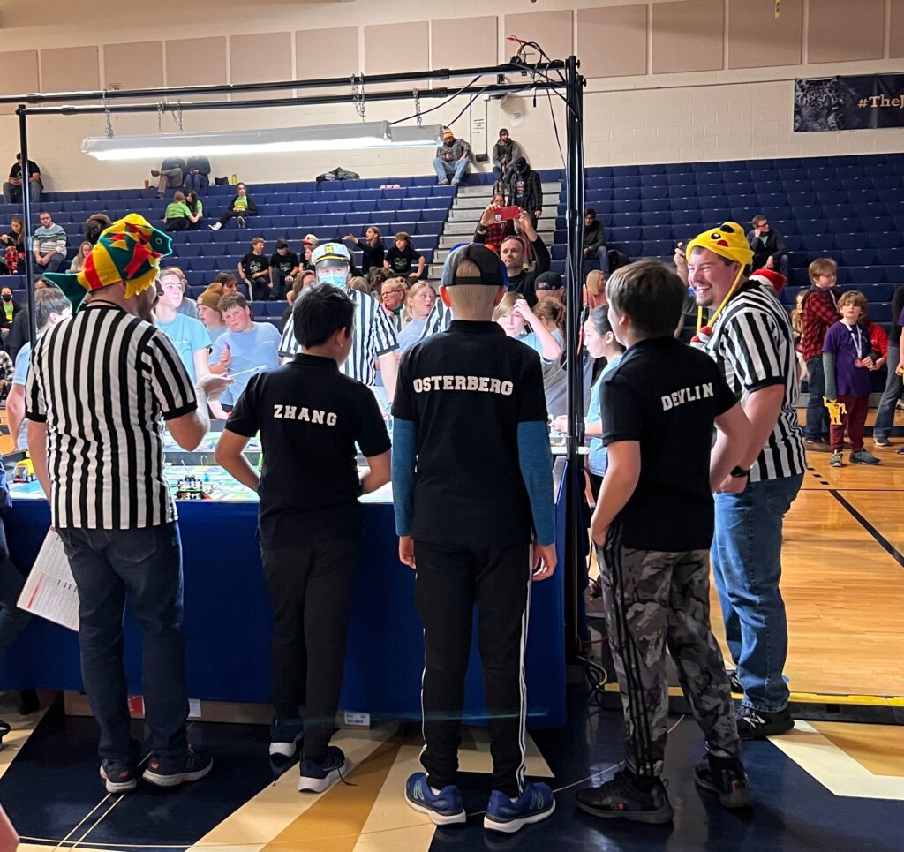
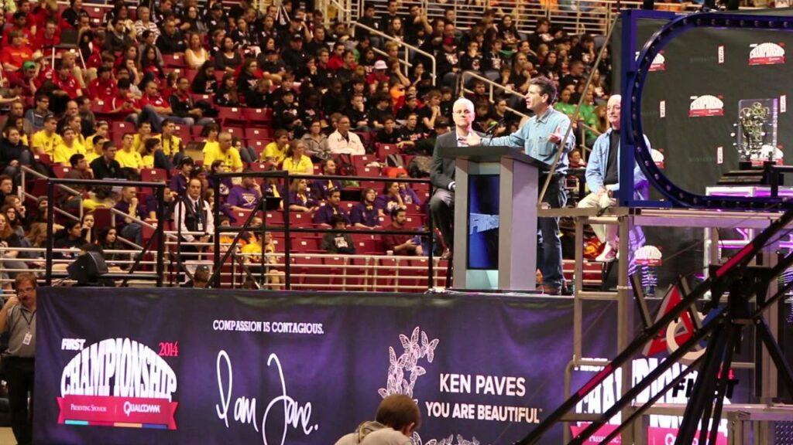
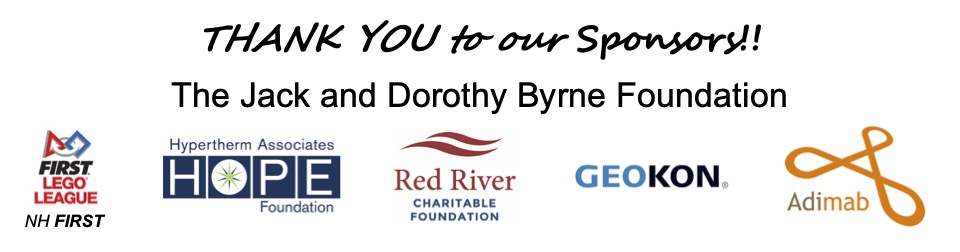

---
## Navigation
- [Home](/index.md) - [Our Team](/our-team/index.md) - [Robot Design](/happy-haptic-doctors-robot-design/index.md) - [2023 FLL](/2023-fll/index.md) - [2024 Worlds](/2024-worlds/index.md) - [2024 Highlights](/2024/index.md) - [2025](/2025/index.md) - [Donate](/donate/index.md)
---

# 2025

The New Hampshire state FTC competition had over 30 teams competing, and [our team](../our-team/index.html) won alliance captain 2nd place! Since we acheived 2nd, we earned an invitation to the 2025 FTC New England Premier, in West Springfield, Massachusetts, in April.

---

## Competition Categories

1. **Robot Game**: Complete missions on the challenge board. This game seems like the main focus, but it isn’t the whole competition.
2. **Robot Design**: A presentation to tell judges about how your robot works, the inspiration, different interations, and why it works well.

Unlike FLL, FTC only contains 2 main judged categories, Robot Game and Robot Design. Each year, the Robot Game, there's different theme and challenges to complete and gain points. For Robot design, you will present to judges about your robot and how the different mechanisms work.
---

## Our Journey to Now

### December 3, 2022

Several of us were on a FLL team in 2022. We made it to states and although we didn’t win, it was great practice for the nextt year!

### September 15, 2023
**2023/24 team – the Happy Haptic Doctors**  
We formed our new FLL team for 2023, and called it the Happy Haptic Doctors.

### April 17, 2024

We attended the 2024 FLL Championship in Houston, Texas.

### September 28, 2024
**2024/25 team – the Happy Haptic Doctors** 
We formed our new FTC team for 2025, and kept the name as the Happy Haptic Doctors.

### April 4, 2025
We attended the 2025 New England FTC Premier in West Springfield, Massachusetts.
---

## Fundraising
One challenge we are facing is the cost, so we are going to start fundraising to raise money to make sure our entire team can keep competing. If you would like to help, please consider [donating](../donate/index.html)!

