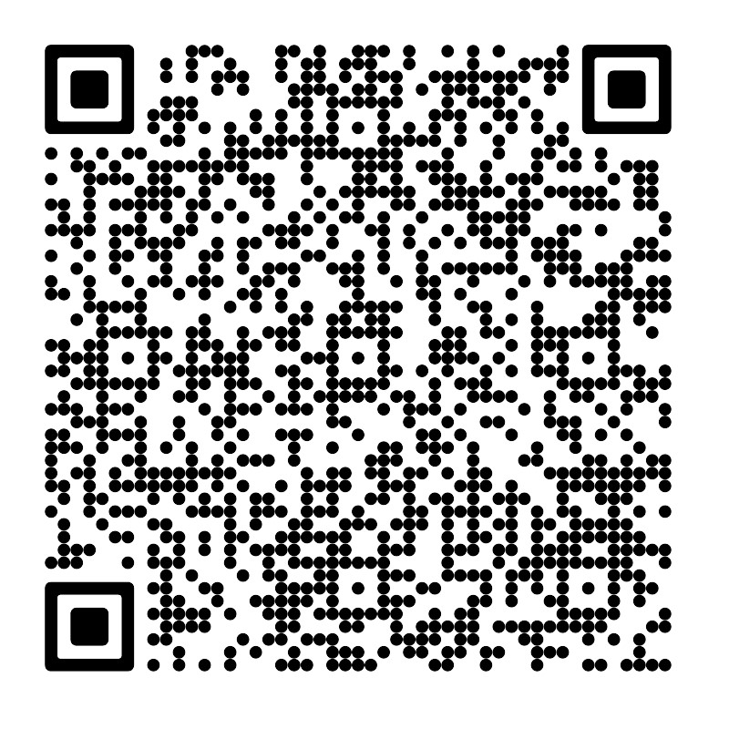

## Navigation
- [Home](/index.md) - [Our Team](/our-team/index.md) - [Robot Design](/happy-haptic-doctors-robot-design/index.md) - [2023 FLL](/2023-fll/index.md) - [2024 Worlds](/2024-worlds/index.md) - [2024 Highlights](/2024/index.md) - [2025](/2025/index.md) - [Donate](/donate/index.md)
---

# Donate

Each year we need to register and purchase parts for the new challenge fields and setup, as well as robot equiptment and parts. Although we try our best to reuse parts from previous years, the expenses add to about $10,000 each year.

<video controls width="600">
  <source src="../wp-content/uploads/2024/01/202401271454.mp4" type="video/mp4">
  Your browser does not support the video tag.
</video>

---

## Expenses we would like to cover with donations

Each year, we need new materials and parts to improve our robot to build optimized prototypes. In addition to travel and registration costs, each year the FTC competition introduces a new game map and challenge setup. Our team needs to purchase the official field elements and materials required to build and practice on the new field. These items are essential for us to prepare for the season, test our robot, and develop effective strategies. These costs add up to about $10,000 each year! Your support will help make it possible for our team to represent our community and pursue our passion for robotics at the highest level.
---

## Ways to Donate

  <a href="https://hcb.hackclub.com/donations/start/fll-challenge-team-61434" style="font-size:2em; font-weight:bold; color:#fff; background:#0074D9; padding: 0.5em 1.5em; border-radius: 8px; text-decoration: none; display: inline-block;">
    Donate
  </a>

---

© 2025 HapLink