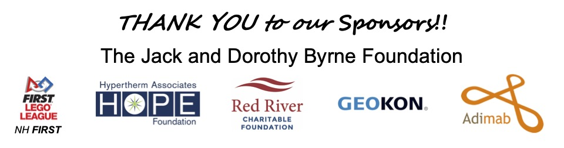

# Donate

Our whole team is planning to travel to Houston in April. Airfare and hotels are especially expensive. We need to raise funds to support our trip!

<video controls width="600">
  <source src="../wp-content/uploads/2024/01/202401271454.mp4" type="video/mp4">
  Your browser does not support the video tag.
</video>

---

## Expenses we would like to cover with donations (needs)

- Airfare for each member of the team and one parent ($700-900 per ticket)
- One hotel room per family (roughly $300/night or $1500 total per family)
- Entry fee for the competition ($2000)
- Materials to build better prototypes to use in our presentation at Worlds ($500)

---

## Additional expenses, if we raise enough (wants)

- Expenses related to having a practice area in Houston (e.g. shipping a table)
- Meal(s) as a team in Houston

---

## Expenses we are paying ourselves

- Airfare for any additional parents who attend
- Airfare and hotel rooms for any family who opts to pay their way
- Travel to and from airports and parking

---

## Total fundraising budget

Currently, we are estimating we will need to raise **$16,500**. It is hard to come up with an exact number because airfare changes every day up until the moment tickets are actually booked. If we have raised any extra money, we will donate this to other local teachers and teams – who are either hoping to attend worlds this year or for next year’s teams.

---

## Ways to Donate

[Donate](https://hcb.hackclub.com/donations/start/fll-challenge-team-61434)

---

© 2023 HapLink